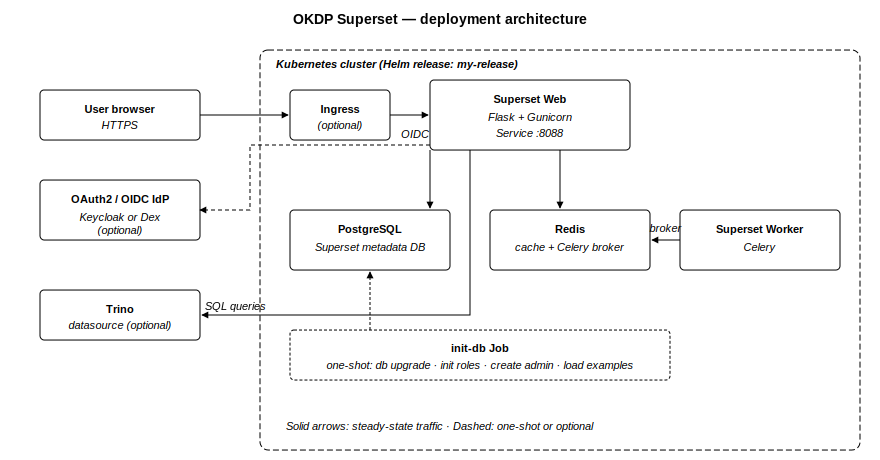

[](https://github.com/OKDP/okdp-superset/actions/workflows/ci.yml)
[](https://github.com/OKDP/okdp-superset/actions/workflows/release-please.yml)
[](https://github.com/OKDP/okdp-superset/releases/latest)
[](http://www.apache.org/licenses/LICENSE-2.0)

# OKDP Superset

OKDP Superset is a packaging of [Apache Superset](https://superset.apache.org/) for Kubernetes: a custom Docker image and a Helm chart that wraps the official Apache Superset chart with OAuth2/OIDC providers (Keycloak, Dex), optional OAuth2 for Trino, and externalized Kubernetes Secrets.

## Why this project

The upstream Apache Superset Helm chart deploys Superset, but several integrations have to be implemented from scratch on every install:

- **OAuth2/OIDC requires custom Python code.** Wiring Keycloak or Dex means writing a `CustomSsoSecurityManager` and injecting it via `configOverrides`.
- **The official Docker image does not bundle Trino, PostgreSQL drivers or `Authlib`.** They have to be installed at deploy time or in a custom image.
- **Secrets live in `values.yaml`.** Database, Redis, OAuth2 and Superset secrets are not separated into dedicated Kubernetes Secrets.
- **No Trino OAuth2 wiring.** The Superset `DATABASE_OAUTH2_CLIENTS` setting is not exposed by the chart.

OKDP Superset adds a thin layer on top that ships these integrations as defaults:

- Ready-to-use Keycloak and Dex providers in the chart.
- `apache-superset[trino,postgres]` and `Authlib` pre-installed in the image.
- Database, Redis, OAuth2, Superset and Trino OAuth2 credentials each in their own Kubernetes Secret.
- Optional OAuth2 client wiring for a Trino datasource.
- Weekly automated rebuild of the latest release tag to pick up base-image security patches.

## What the project does

This repository builds and publishes:

- A Docker image based on `apache/superset` with extra Python dependencies pre-installed — `apache-superset[trino,postgres]>=6.0.0,<7.0.0` and `Authlib` ([`docker/requirements.txt`](docker/requirements.txt)).
- Security-patched rebuilds of the upstream `-dockerize` and `-websocket` image variants used as init and websocket sidecars by the chart.
- A Helm chart that wraps the official Apache Superset chart ([`helm/superset/Chart.yaml`](helm/superset/Chart.yaml) depends on `superset` `0.15.2`) and adds the OKDP defaults listed in [Why this project](#why-this-project).

## Components

All artefacts are published under [`quay.io/okdp`](https://quay.io/organization/okdp):

| Artefact | Registry | Description |
|:---------|:---------|:------------|
| Docker image | [`quay.io/okdp/superset`](https://quay.io/repository/okdp/superset) | Apache Superset + Trino + PostgreSQL drivers + Authlib pre-installed. |
| `-dockerize` variant | `quay.io/okdp/superset:<v>-dockerize` | Security-patched rebuild of `apache/superset:<v>-dockerize` (init utility). |
| `-websocket` variant | `quay.io/okdp/superset:<v>-websocket` | Security-patched rebuild of `apache/superset:<v>-websocket` (websocket sidecar). |
| Helm chart | [`quay.io/okdp/charts/superset`](https://quay.io/repository/okdp/charts/superset) | Wrapping chart with OKDP defaults. |

### Tag format

| Image | Tag examples |
|:------|:-------------|
| `quay.io/okdp/superset` | `6.0.0`, `6.0.0-1.0`, `6.0.0-dockerize`, `6.0.0-1.0-dockerize`, `6.0.0-websocket`, `6.0.0-1.0-websocket` |
| `quay.io/okdp/charts/superset` | `0.15.2-2.0`, `0.15.2-1.0`, `0.15.0-1.1` |

- `<superset-version>` matches the upstream Apache Superset release (e.g. `6.0.0`).
- `<superset-version>-<okdp-build>` adds an OKDP-specific build number (e.g. `6.0.0-1.0`) — bumped whenever the OKDP layer changes without a Superset upgrade.
- Chart versions follow `<chart-version>-<okdp-build>` (e.g. `0.15.2-2.0`) where `<chart-version>` matches the upstream Apache Superset Helm chart.

## Architecture

The diagram below shows the components that a `helm install` of this chart creates inside a Kubernetes cluster, plus the external services Superset can be wired to (an OAuth2/OIDC IdP and a Trino coordinator). For the upstream Superset runtime design (Flask, Celery, Redis as broker, metadata DB), see the [official Apache Superset documentation](https://superset.apache.org/docs/intro).

<p align="center">
  
</p>

A `helm install` creates the Superset web Deployment, the Celery worker Deployment, plus an embedded PostgreSQL ([`helm/superset/values.yaml#L1106`](helm/superset/values.yaml#L1106)) and Redis ([`helm/superset/values.yaml#L1151`](helm/superset/values.yaml#L1151)). Both can be disabled to bring your own (`superset.postgresql.enabled: false` / `superset.redis.enabled: false`). External IdPs (Keycloak, Dex) and the Trino coordinator are reached over the network; the chart wires the corresponding env vars and Python `configOverrides` for you.

## Prerequisites

- Kubernetes cluster — known-good tested baseline: **Kubernetes 1.30** (kind), works with `>= 1.19`.
- [Helm](https://helm.sh/) — known-good tested baseline: **Helm 3.18**, works with `>= 3`.
- `openssl` to generate the Flask secret key in [Quick Start](#quick-start).
- A default `StorageClass` providing dynamic PV provisioning (the bundled PostgreSQL and Redis subcharts request PVCs by default).

## Quick Start

```sh
helm upgrade --cleanup-on-fail --install my-release \
  oci://quay.io/okdp/charts/superset --version 0.15.2-2.0 \
  --set okdp.superset.superset_secret_key=$(openssl rand -base64 42)
```

> `okdp.superset.superset_secret_key` is used by Flask to sign session cookies and encrypt sensitive data in the Superset metadata DB. Generate a strong unique value with `openssl rand -base64 42` and treat it as a long-lived secret. Replace `0.15.2-2.0` with the [latest released chart version](https://github.com/OKDP/okdp-superset/releases).

### Expected result

```sh
kubectl get pods
# NAME                                          READY   STATUS      RESTARTS       AGE
# my-release-postgresql-0                       1/1     Running     0              2m
# my-release-redis-master-0                     1/1     Running     0              2m
# my-release-superset-78c5797746-vg8fx          1/1     Running     0              2m
# my-release-superset-init-db-t4fjw             0/1     Completed  0              2m
# my-release-superset-worker-848cd5895d-2svb4   1/1     Running     0              2m
```

A few `RESTARTS` on `my-release-superset-*` and `my-release-superset-worker-*` are normal on a resource-constrained cluster (laptop, kind) — the liveness/readiness probes have aggressive timeouts and may fail under load. As long as the pods reach `READY 1/1` and `/health` returns `200`, the release is healthy.

Port-forward the Superset web service and check the health endpoint:

```sh
kubectl port-forward svc/my-release-superset 8088:8088
curl -sL -o /dev/null -w "%{http_code}\n" http://127.0.0.1:8088/health
# 200
```

Open <http://127.0.0.1:8088> and log in with the default admin user (`admin` / `admin`, [`helm/superset/values.yaml#L1030-L1036`](helm/superset/values.yaml#L1030-L1036)). **Change the password immediately**, or enable OAuth2 (see [Configuration](#configuration)).

## Installation

A ready-to-use values file is provided at [`helm/superset/sample-values.yaml`](helm/superset/sample-values.yaml) — Keycloak OAuth2, nginx Ingress with cert-manager (Let's Encrypt staging), examples loading at install time.

```sh
helm upgrade --cleanup-on-fail --install my-release \
  oci://quay.io/okdp/charts/superset --version 0.15.2-2.0 \
  --values helm/superset/sample-values.yaml
```

A complete reference of the chart values is available in the [Helm chart README](helm/superset/README.md), auto-generated from [`helm/superset/values.yaml`](helm/superset/values.yaml) by [helm-docs](https://github.com/norwoodj/helm-docs).

## Cleanup

```sh
helm uninstall my-release
```

The PostgreSQL and Redis subcharts use StatefulSets with PVCs that are **not** deleted by `helm uninstall`. To fully wipe the metadata DB:

```sh
kubectl delete pvc -l app.kubernetes.io/instance=my-release
```

## Configuration

The chart exposes two top-level value sections:

- `okdp:` — OKDP-specific high-level configuration, summarised below.
- `superset:` — passthrough to the upstream [`superset`](https://apache.github.io/superset) subchart; any upstream value can be set under this prefix.

The most important OKDP-specific keys (full reference in [`helm/superset/values.yaml`](helm/superset/values.yaml) and the [Helm chart README](helm/superset/README.md)):

| Key | Default | Description |
|:----|:--------|:------------|
| `okdp.superset.superset_secret_key` | *(insecure placeholder — override)* | Flask session cookie signing key. |
| `okdp.superset.load_examples.enabled` | `false` | If `true`, the init Job loads the upstream Superset example dashboards. |
| `okdp.oauth.enabled` / `okdp.oauth.provider` | `false` / `""` | Toggle OAuth2/OIDC and pick `keycloak` or `dex`. |
| `okdp.oauth.base_url` / `client_id` / `client_secret` / `scope` | — | OAuth2/OIDC client parameters. |
| `okdp.oauth.oauth2_superset_roles_mapping` | *(empty)* | Map IdP groups/roles to Superset roles. |
| `okdp.trino.oauth.enabled` | `false` | Enable OAuth2 for the Trino datasource. |

Upstream Apache Superset chart values (e.g. `superset.image`, `superset.ingress`, `superset.init.adminUser`, `superset.postgresql.enabled`, `superset.redis.enabled`) are passed through to the official subchart.

## Alternatives

- **Apache Superset upstream Helm chart** ([`apache.github.io/superset`](https://apache.github.io/superset)) — bare chart without OAuth2 providers, Trino bundling, externalized secrets or multi-arch images.
- **Apache Superset on Docker Compose** ([`apache/superset` Docker Compose](https://github.com/apache/superset/blob/master/docker-compose.yml)) — official non-Kubernetes deployment, mostly for local development.
- **[Metabase](https://www.metabase.com/)** — open-source BI tool, simpler to deploy but less extensible than Superset for SQL-heavy dashboards.
- **[Redash](https://github.com/getredash/redash)** — open-source SQL dashboarding tool, smaller scope than Superset.

## Build

Build and publication are automated via GitHub Actions ([`.github/workflows/`](.github/workflows/)):

- [`ci.yml`](.github/workflows/ci.yml) — on every PR and push: build the three Docker images (`superset`, `-dockerize`, `-websocket`), lint the Helm chart, regenerate helm-docs.
- [`release-please.yml`](.github/workflows/release-please.yml) — on merge to `main`, [release-please](https://github.com/googleapis/release-please) opens a release PR that bumps versions and updates the `CHANGELOG`. When merged, the Docker images are pushed to `quay.io/okdp/superset` and the Helm chart to `quay.io/okdp/charts/superset`.
- [`docker-rebuild.yml`](.github/workflows/docker-rebuild.yml) — weekly rebuild of the latest release tag (Tuesday 05:00 UTC, `cron: "0 5 * * 2"`) to pick up upstream base image security patches.
- [`helm-lint-template.yml`](.github/workflows/helm-lint-template.yml) — chart lint and `helm-docs` regeneration.

Images are built and published for `linux/amd64` and `linux/arm64`.

## Test

After running the [Quick Start](#quick-start), check the Superset health endpoint:

```sh
kubectl port-forward svc/my-release-superset 8088:8088 &
curl -sL -o /dev/null -w "%{http_code}\n" http://127.0.0.1:8088/health
```

Expected result:

```
200
```

For a deeper smoke test, run the [Installation](#installation) command with `--values helm/superset/sample-values.yaml` (which sets `okdp.superset.load_examples.enabled=true`) and confirm the example dashboards are loaded:

```sh
PG_PASS=$(kubectl get secret my-release-superset-db-env -o jsonpath='{.data.DB_PASS}' | base64 -d)
kubectl exec my-release-postgresql-0 -- \
  env PGPASSWORD="$PG_PASS" psql -U superset -d superset -tAc \
  "SELECT 'dashboards', count(*) FROM dashboards UNION ALL SELECT 'slices', count(*) FROM slices;"
```

Expected result:

```
dashboards|11
slices|121
```

## Troubleshooting

- **`helm install` fails with `Could not locate a version matching provided version string`** — OCI chart pulls do not resolve a default version; always pass `--version <chart-version>` to `helm install`, `helm upgrade` and `helm pull`.
- **`helm install` fails with `Error: failed post-install: timed out waiting for the condition`** — the default Helm timeout (5 min) is too short on resource-constrained clusters (laptop, kind). The init-db Job runs upstream `bitnami/postgresql:latest` and `bitnami/redis:latest` images, whose `latest` tag forces `imagePullPolicy: Always` and re-pulls them at every install. Pass `--timeout 15m` (or higher) to give the post-install hook enough time.
- **Pods stuck in `Pending`** — no default `StorageClass`, so PVCs cannot be bound. Either provision a default `StorageClass`, or disable persistence for testing: `--set superset.postgresql.primary.persistence.enabled=false --set superset.redis.master.persistence.enabled=false`.
- **After login, the browser loops back to `/login/`** — most often a mismatch between `okdp.oauth.base_url` and the IdP. Check that `base_url` does **not** end with `/.well-known/openid-configuration` (it is appended automatically), and that the IdP callback URL is set to `https://<your-superset-host>/oauth-authorized/<provider>`.
- **Web pod logs `ImportError: Authlib not installed`** — the deployment is not using the OKDP image. Set `superset.image.repository=quay.io/okdp/superset` and a matching `superset.image.tag` (or use the chart defaults).

## License

Apache License 2.0 — see [LICENSE](LICENSE).

---

**Built 🚀 for the OKDP Community**
<a href="https://okdp.io">
  
</a>
